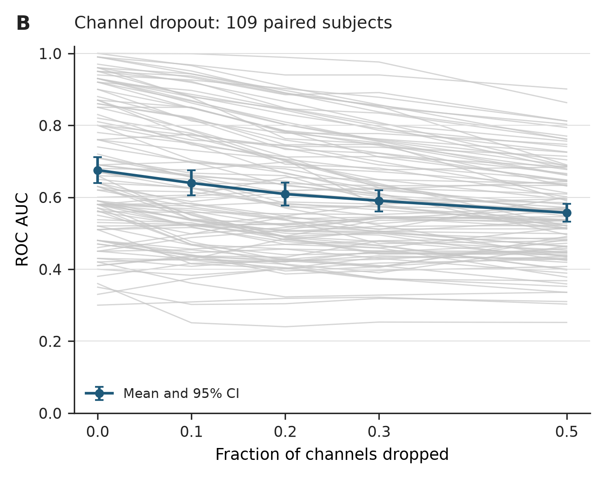
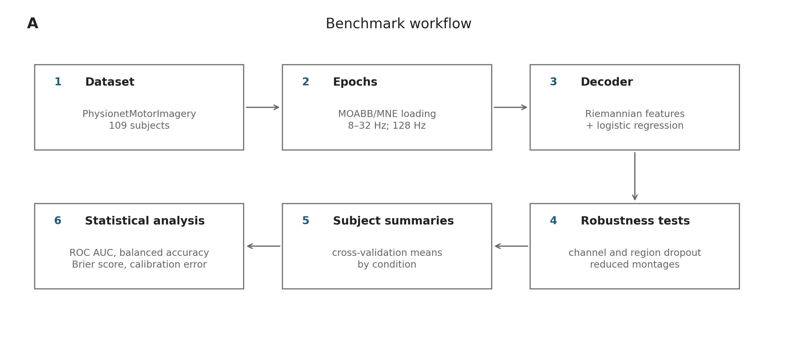

<h1 align="center">Motor-Imagery EEG Decoder Robustness Benchmark</h1>

<p align="center">
  <strong>How much performance survives when EEG channels fail, disappear, or must be reduced?</strong>
</p>

<p align="center">
  A reproducible, participant-level comparison of CSP–LDA and Riemannian
  tangent-space decoding on two public motor-imagery EEG datasets.
</p>

<p align="center">
  <a href="https://github.com/ZyntZ/motor-imagery-eeg-decoder-robustness/actions/workflows/ci.yml"></a>
  <a href="https://github.com/ZyntZ/motor-imagery-eeg-decoder-robustness/releases/latest"></a>
  <a href="https://doi.org/10.5281/zenodo.21780413"></a>
  <a href="LICENSE"></a>
  <a href="https://colab.research.google.com/github/ZyntZ/motor-imagery-eeg-decoder-robustness/blob/main/examples/quickstart.ipynb"></a>
  
</p>

<p align="center">
  <a href="#key-result"><strong>Key result</strong></a> ·
  <a href="#benchmark-design"><strong>Benchmark design</strong></a> ·
  <a href="#one-participant-quickstart"><strong>Run the quickstart</strong></a> ·
  <a href="#quick-validation"><strong>Validate outputs</strong></a> ·
  <a href="#full-reproduction"><strong>Re-run EEG analysis</strong></a> ·
  <a href="#citation"><strong>Citation</strong></a>
</p>

---

## Key result

In the completed PhysioNet analysis (**109 paired participants**), both offline
decoders degraded under simulated test-time channel loss:

| Decoder | Clean ROC-AUC | 50% channels zeroed | Paired change | 95% CI |
|---|---:|---:|---:|---:|
| CSP–LDA | 0.655 | 0.528 | −0.127 | [−0.153, −0.102] |
| Riemann–LR | 0.675 | 0.557 | −0.119 | [−0.138, −0.098] |

<p align="center">
  
</p>

<p align="center"><em>Riemann–LR on PhysioNet. Grey lines are participants; blue points and bars are the mean and 95% confidence interval.</em></p>

The 9-channel montage estimates remained close to their full-montage estimates:

- **CSP–LDA:** mean paired change 0.014, 95% CI [−0.013, 0.040]
- **Riemann–LR:** mean paired change 0.001, 95% CI [−0.027, 0.030]

No equivalence or non-inferiority margin was specified. These intervals therefore
do **not** establish equivalence.

> [!IMPORTANT]
> Channel zeroing represents complete loss of selected electrodes. It does not
> model impedance noise, bridging, clipping, intermittent contact, cap
> displacement, or online recalibration. Results are offline and come from
> healthy-participant datasets; they do not establish prosthesis-control or
> clinical performance.

## At a glance

| Component | Specification |
|---|---|
| Datasets | PhysioNet EEG Motor Movement/Imagery (`n=109`) and BNCI2014-001 (`n=9`) |
| Task | Binary left- versus right-hand motor imagery |
| Pipelines | CSP + linear discriminant analysis; covariance + Riemannian tangent space + logistic regression |
| Preprocessing | 8–32 Hz; resampled to 128 Hz |
| Stress tests | 10%, 20%, 30%, and 50% random channel zeroing; regional dropout; 3- and 9-channel retraining; cross-session transfer where available |
| Primary outcome | Receiver operating characteristic area under the curve (ROC-AUC) |
| Analysis unit | Participant, not fold or dropout repeat |
| Current release | [`v0.3.2`](https://github.com/ZyntZ/motor-imagery-eeg-decoder-robustness/releases/tag/v0.3.2) |
| Archived release | [Zenodo DOI 10.5281/zenodo.21780413](https://doi.org/10.5281/zenodo.21780413) |

## Benchmark design

<p align="center">
  
</p>

### Decoders

| Short name | Pipeline | Role |
|---|---|---|
| **CSP–LDA** | Common spatial patterns → linear discriminant analysis | Classical motor-imagery baseline |
| **Riemann–LR** | Covariance matrices → Riemannian tangent-space features → logistic regression | Geometry-aware covariance baseline |

### Robustness conditions

| Condition | What changes | What it estimates |
|---|---|---|
| Clean | Full available montage | Reference performance |
| Random channel dropout | 10–50% of channels set to zero at test time | Sensitivity to complete unexpected signal loss |
| Regional dropout | Left, midline, or right motor-strip channels removed | Sensitivity to anatomically structured loss |
| Reduced montage | Models retrained and tested using 3 or 9 motor-area channels | Performance after planned montage reduction |
| Cross-session | First session used for training; later sessions used for testing when available | Session-transfer robustness |

Reduced-montage retraining and unexpected test-time dropout answer different
questions and should not be interpreted as the same intervention.

## Datasets and provenance

Raw EEG is **not** included in this repository. Data are downloaded through
[MOABB](https://github.com/NeuroTechX/moabb) and
[MNE-Python](https://github.com/mne-tools/mne-python).

| Dataset | Participants in the release | Access |
|---|---:|---|
| PhysioNet EEG Motor Movement/Imagery v1.0.0 | 109 | [Dataset DOI 10.13026/C28G6P](https://doi.org/10.13026/C28G6P) |
| BNCI2014-001 | 9 | [BNCI Horizon 2020](http://bnci-horizon-2020.eu/database/data-sets) via MOABB |

Dataset identifiers, access routes, licenses, and redistribution boundaries are
documented in [`DATA_PROVENANCE.md`](DATA_PROVENANCE.md). Source datasets retain
their own licenses.

## One-participant quickstart

Run a compact CSP–LDA channel-dropout demonstration on one PhysioNet
participant without configuring the full benchmark locally:

<p align="center">
  <a href="https://colab.research.google.com/github/ZyntZ/motor-imagery-eeg-decoder-robustness/blob/main/examples/quickstart.ipynb"></a>
</p>

The notebook downloads public EEG data through MOABB, trains on clean data,
and evaluates deterministic 10%, 30%, and 50% test-time channel dropout. It
uses two masks per non-zero fraction to keep the demonstration compact. Runtime
varies with the data download and the execution environment.

This is a usability demonstration, not a reproduction of the 109-participant
population estimates reported above. For those estimates, use the full
reproduction commands below.

To run the same quickstart locally after installing the EEG dependencies:

```bash
python scripts/run_benchmark.py \
  --config configs/quickstart_physionet.yaml \
  --download-and-run \
  --dataset PhysionetMI \
  --subjects 1 \
  --pipeline csp_lda \
  --overwrite \
  --suffix quickstart
```

## Quick validation

Use this path to inspect the committed results and verify repository consistency
**without downloading or refitting the EEG datasets**.

The reference lock file targets **CPython 3.11 on Linux**.

```bash
git clone https://github.com/ZyntZ/motor-imagery-eeg-decoder-robustness.git
cd motor-imagery-eeg-decoder-robustness

python -m venv .venv
source .venv/bin/activate
python -m pip install --upgrade pip
python -m pip install -r requirements-lock.txt
python -m pip install -e . --no-deps

python -m pytest
make validate-results
make compare-physionet-pipelines
make submission-readiness
```

These checks cover code behavior, metadata, release structure, and internal
consistency of the committed tables. They do not recreate preprocessing or model
fits.

To regenerate summaries from the available completed PhysioNet outputs without
refitting decoders:

```bash
make postprocess-physionet-full-available
```

## Full reproduction

Install the optional EEG dependencies and run the benchmark from the source
datasets:

```bash
python -m pip install -e ".[eeg]"
make bnci-full
make physionet-full
```

The full commands download data through MOABB/MNE and may take several hours.
Participant checkpoints allow interrupted runs to resume. See
[`REPRODUCIBILITY.md`](REPRODUCIBILITY.md) for environment setup, validation
boundaries, expected outputs, and troubleshooting.

> [!WARNING]
> The current participant-specific mask protocol and the legacy shared-mask
> protocol must not be mixed. Use a separate output directory or archive the
> committed tables before running a different protocol.

### Protocols

- [`configs/benchmark_independent_masks.yaml`](configs/benchmark_independent_masks.yaml)
  is the default for current runs. Random masks are deterministic but
  participant-specific, while decoder families receive matched masks within a
  participant.
- [`configs/benchmark.yaml`](configs/benchmark.yaml) preserves the legacy shared
  mask schedule for exact reproduction of earlier `v0.3` outputs.

Each checkpoint stores its protocol version, mask-seed scope, and run signature.
The runner rejects checkpoints that do not match the active configuration.

## Statistical analysis

Population inference uses participants as independent observational units.
Folds and dropout repeats are aggregated within participants before inference.

- **Primary outcome:** ROC-AUC
- **Secondary outcome:** balanced accuracy
- **Calibration outcomes:** Brier score and expected calibration error when
  predicted probabilities are available
- **Paired inference:** confidence intervals, effect sizes, paired parametric
  tests, signed-rank sensitivity tests, and false-discovery-rate adjustment
- **Secondary modelling:** mixed-effects models with participant random
  intercepts, accompanied by diagnostic and sensitivity analyses

PhysioNet estimates are conditional on one shuffled cross-validation split and
one participant-specific mask schedule per participant. Sensitivity to
alternative splits and mask schedules was not measured.

Full estimands, assumptions, multiplicity rules, diagnostics, and missing-data
handling are documented in
[`STATISTICAL_REPORTING.md`](STATISTICAL_REPORTING.md).

## Repository guide

| Path | Contents |
|---|---|
| [`configs/`](configs) | Benchmark parameters and protocol definitions |
| [`examples/`](examples) | One-participant Colab and local quickstarts |
| [`src/bci_robustness/`](src/bci_robustness) | Evaluation and summary functions |
| [`scripts/`](scripts) | Command-line benchmark, analysis, validation, and release tools |
| [`results/`](results) | Fold-, participant-, and population-level result tables |
| [`reports/`](reports) | Generated statistical reports, figures, and validation output |
| [`artifacts/`](artifacts) | Machine-readable manifests and release-validation records |
| [`manuscript/`](manuscript) | Article source and submission figures |
| [`tests/`](tests) | Unit, integration, and release-gate tests |

### Research documentation

- [`DATA_PROVENANCE.md`](DATA_PROVENANCE.md): datasets, licenses, and provenance
- [`REPRODUCIBILITY.md`](REPRODUCIBILITY.md): environments and reproduction paths
- [`STATISTICAL_REPORTING.md`](STATISTICAL_REPORTING.md): estimands and assumptions
- [`SUBMISSION_READINESS.md`](SUBMISSION_READINESS.md): automated release and
  manuscript-readiness checks

## Citation

If you use the benchmark, cite the archived release and the original datasets
listed in [`DATA_PROVENANCE.md`](DATA_PROVENANCE.md):

> Sokolova, Anna Nikolaevna. *Motor-Imagery EEG Decoder Robustness Benchmark*,
> version 0.3.2. Zenodo. https://doi.org/10.5281/zenodo.21780413

GitHub also renders citation metadata from [`CITATION.cff`](CITATION.cff) through
the repository's **Cite this repository** control.

## Scope and limitations

This repository supports claims about **offline decoder robustness under the
implemented perturbations**. It does not by itself establish:

- robustness to realistic continuous electrode artefacts;
- online adaptation or closed-loop BCI performance;
- generalization to patients or prosthesis users;
- clinical safety or benefit;
- equivalence of reduced and full montages;
- causal superiority of one decoder family.

The source datasets contain healthy participants. Cross-session outputs are
available only where session metadata permit them; in the current release,
cross-session manuscript results are restricted to BNCI2014-001 (`n=9`).

## Contributing

Bug reports, reproducibility checks, dataset adapters, and carefully scoped
robustness extensions are welcome. See [`CONTRIBUTING.md`](CONTRIBUTING.md) for
the scientific and software checks used for contributions.

## License

Benchmark code is released under the [BSD 3-Clause License](LICENSE). Raw EEG is
not redistributed, and each source dataset remains governed by its own license.
